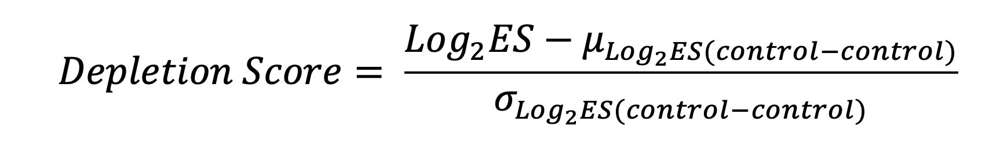
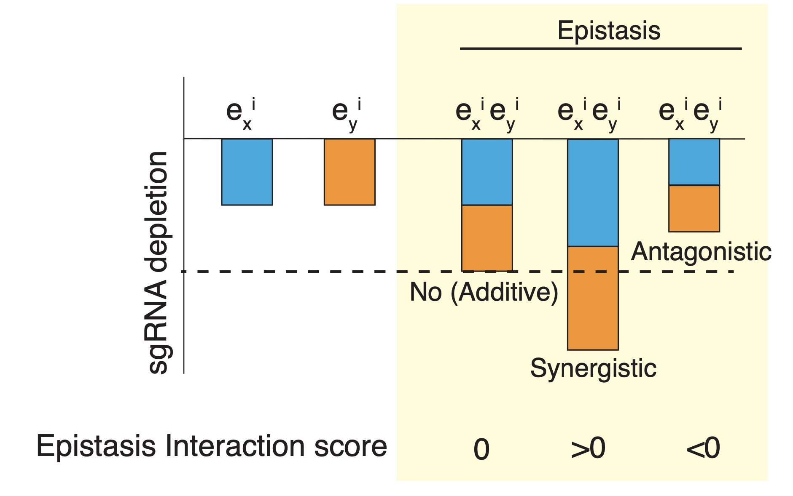
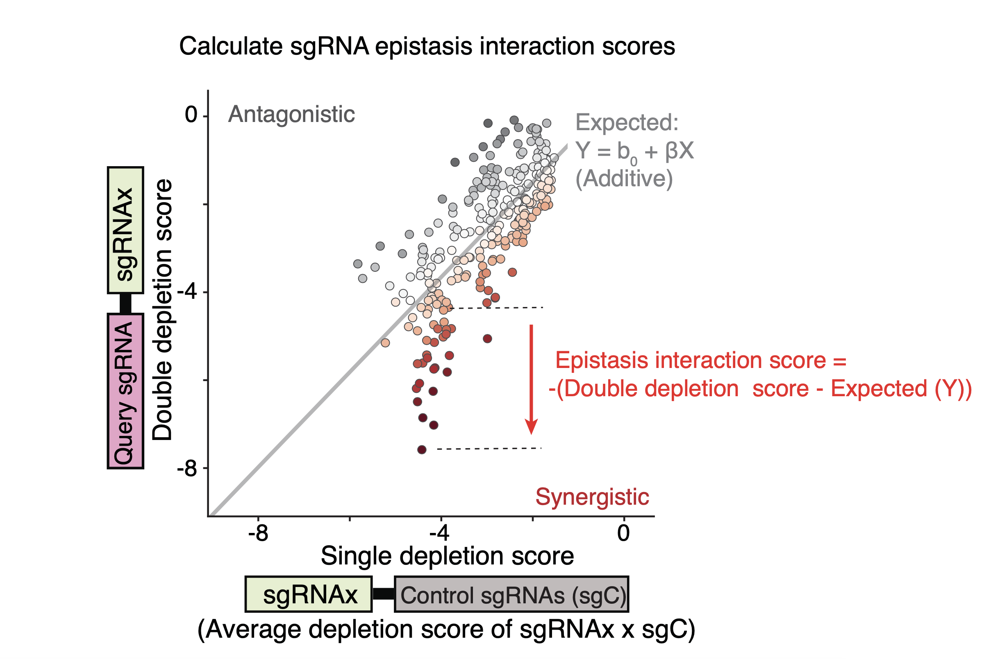

# Multiplexed_CRISPRi_EnhancerNet
# 1. Calculate the depletion score for multiplexed CRISPRi screen.
Firstly, to obtain sufficient representative reads for the downstream calculation, counts of sgRNA pairs were first filtered by requiring all paired constructors with at least 30 reads in D0, then added with a pseudocount of 10. The log2 enrichment scores of all sgRNA pairs were then calculated in D30 relative to D0 by using the relative frequencies in D0 and D30. The mean and the standard deviation of enrichment scores for paired control sgRNAs (control-control; control sgRNAs: sgRNAs targeting control regions + sgRNAs without targeting regions) were used to normalize the log2 enrichment scores. The normalized log2 enrichment scores were represented as the depletion score (See below equation; Log2 ES: log2 enrichment score).

# 2. Calculate the epistasis score for sgRNA pairs targeting enhancers
## The defination of epistasis types with interaction score

## An additive model to calculate the interaction score to measure epistasis 
The single depletion scores were calculated for each sgRNA from the averaged depletion scores of the paired sgRNAs which contain the given sgRNA and one non-targeting sgRNA. The double depletion score of the sgRNA pair was calculated by averaging the same sgRNAs in two permutations (A/B and B/A) to obtain the symmetric depletion score matrix. The epistasis interaction scores of the sgRNA pairs between a given sgRNA (Query sgRNA) and other sgRNAs were calculated based on their depletion scores. To do this, the depletion scores of the sgRNA pairs were first plotted against the single depletion score for all the sgRNAs paired with the Query sgRNA. Next, a linear curve was fitted to the distribution of data points.

The interaction score of Query sgRNA and another sgRNA (sgRNAi) was computed as the negative deviation between the observed double depletion score and the expected value of the fitted linear curve to the single depletion score of sgRNAi. All interaction scores were normalized to the mean and the standard deviation of the interaction scores of the Query sgRNA and control sgRNA pairs.
